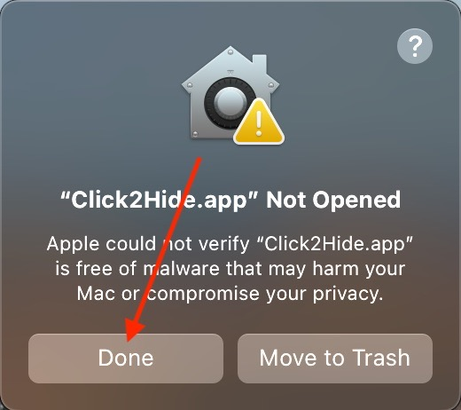
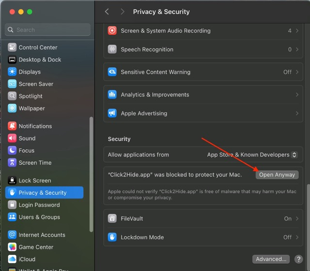
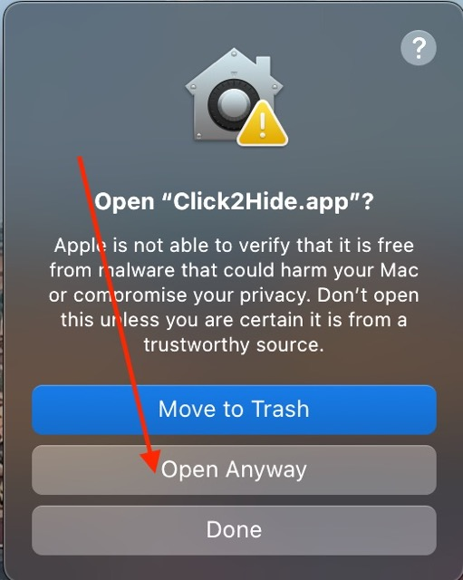

# Click2Hide

## Overview

No more hunting for hidden windows on your Mac. **Click2Hide** automatically hide/un-minimizes apps when you click on the app icon on dock, saving you precious time and frustration whether you're deep in a presentation, juggling multiple projects, or simply desire a cleaner workspace.

## Installation

1. Download the latest version of Click2Hide.dmg from the [Releases](https://github.com/victorwon/click2hide/releases) page.
2. Open the dmg file, drag and drop the Click2Hide.app to the Applications folder.
3. You may now open the Click2Hide.app from the Applications folder and follow the steps to bypass the gatekeeper on MacOS Sequoia. This is a one-time procedure. For MacOS Ventura and Sonoma, only the last two steps are necessary. Additionally, this is an open-source application. Therefore, in the event of any security concerns, you may verify the code to ease your mind.
   
   
   

4. Finally, when app is opened, it will ask for the necessary accessibility and automation permissions. Please grant all, otherwise the app will not work.

https://github.com/user-attachments/assets/16ccca31-f3f3-4948-8f84-d06c84ac292c

## Usage

- **Hide Applications**: Simply click on the Dock icon of the application you wish to hide.
- **Unhide Applications**: If the application is already hidden, clicking its Dock icon will unhide it.

## License

This project is licensed under the MIT License - [Open Source Initiative](https://opensource.org/licenses/MIT).
